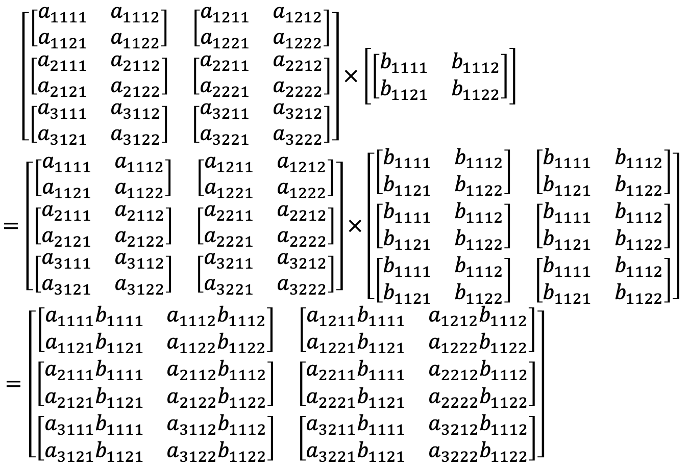
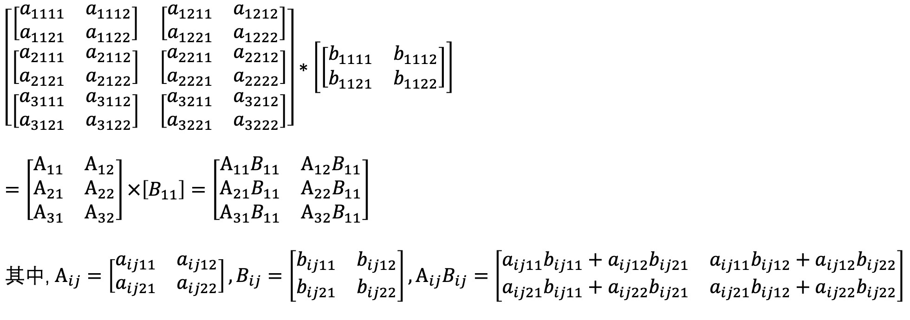

## 问题描述

张量（tensor）乘法和广播（broadcasting）是一种在张量之间进行运算的方法，它可以用来表示一些复杂的数学和物理问题，例如神经网络，图像处理，信号处理等。为了理解张量乘法和广播，我们首先需要了解什么是张量，以及它的形状和维度。
张量（tensor）是一种可以表示多维数组的数据结构，它可以有任意的维度和形状。维度（dimension）是张量的层次，表示张量有多少个方向或轴（axis）。形状（shape）是一个表示每个维度大小的整数元组，表示张量在每个方向上有多少个元素。例如，一个标量（scalar）是一个零维张量，它只有一个数值，没有方向，也没有形状；一个向量（vector）是一个一维张量，它有一个方向，也就是一个轴，它的形状是一个单元素的元组，表示它在这个方向上有多少个元素；一个矩阵（matrix）是一个二维张量，它有两个方向，也就是两个轴，它的形状是一个双元素的元组，表示它在这两个方向上分别有多少个元素；一个立方体（cube）是一个三维张量，它有三个方向，也就是三个轴，它的形状是一个三元素的元组，表示它在这三个方向上分别有多少个元素，以此类推。我们可以用以下的图示来表示不同维度的张量：

其中0维张量可用一个可表示为标量，1维张量可表示为向量，2维张量可表示为矩阵，更高维的张量可视为由低维张量作为元素构成的向量、矩阵等：
如3维张量可表示为

在张量之间进行运算时，我们需要考虑它们的形状是否匹配，以及是否需要进行广播（broadcasting）。广播是一种在支持张量的框架中，如Numpy和Pytorch，为了应对形状不同的张量进行运算所执行的操作。广播的目的是将两个不同形状的张量变成两个形状相同的张量，即先对小的张量添加轴（使其维度与较大的张量相同），再把较小的张量沿着新轴重复（使其形状与较大的相同）。例如，如果我们想要对一个形状为（2，3）的矩阵和一个形状为（3）的向量进行加法，我们可以先给向量添加一个轴，使其形状变为（1，3），然后再沿着新轴复制两份，使其形状变为（2，3），最后再与矩阵逐元素相加，得到一个形状为（2，3）的矩阵。我们可以用以下的过程来表示（注意，并非任意两个张量都能够进行广播，需要形状满足特定条件，后两段具体说明）：

更具体而言，广播（broadcasting）是一种在支持张量的框架中，如Numpy[1] 和Pytorch[2] ，为了应对形状不同但满足某些特定条件（下一段具体说明）的张量进行运算所执行的操作。广播的目的是将两个不同形状的张量变成两个形状相同的张量，即先对小的张量添加轴（使其维度与较大的张量相同），再把较小的张量沿着新轴重复（使其形状与较大的相同）。广播兼容的张量可以进行加法，乘法等运算，运算结果的形状是两个张量形状的较大者。
广播的原则是：如果两个张量的后缘维度（trailing dimension，即从末尾开始算起的维度）的轴长度相符，或其中的一方的长度为1，则认为它们是广播兼容的。广播会在缺失和（或）长度为1的维度上进行。例如，一个形状为（3，2，2，2）的4维张量A和一个形状为（1，1，2，2）的4维张量B是广播兼容的，它们相乘的过程如下所示，先将B在第一维方向上复制3份，第二维方向上复制2份，这样它的形状和A相同，之后进行逐元素乘。

 
结合上述张量乘法和广播机制，以及标准的线性代数中的矩阵乘法，我们考虑如下的运算：计算X1*X2*...*Xn，每个Xi代表一个K维张量。有以下说明：
    1.它们的维度数K一样，且大于等于2。例如都是三维张量或都是四维张量。
    2.将每一个K维张量看成由矩阵（2维张量) 作为元素构成的K-2维张量。前K-2维按照上述的张量乘法和广播进行运算，最后2维按照标准矩阵乘法进行运算。例如
	

    3.为满足最后两维按照标准矩阵乘法，相邻两个张量的后两维必须满足矩阵乘法的要求，即X(i)的最后一维大小必须等于X(i+1)的倒数第二维大小。
    4.为满足张量乘法和广播机制的要求，对前K-2维中任意第k维，任何张量Xi在该维度的大小只能是两个取值中的一个：1或Dk。Dk为一大于1的正整数，对于不同维度k，k'，对应的Dk，Dk'可不同。前K-2维中按照可广播的逐元素乘。即相邻两个张量Xi,X(i+1)相乘时，对于任意维度k: 1≤k≤K-2，如果Xi第k维大小等于X(i+1)第k维大小, 则在该维度上逐元素相乘；如果Xi第k维大小不等于X(i+1)第k维大小，即其中一个等于1，另一个等于Dk，则进行广播并逐元素乘（将该维度等于1的张量在该维度上复制Dk份后，与另一张量在该维度上逐元素乘）。
    5.定义计算开销为需要进行的标量乘法的次数。求给定n个张量依次相乘的计算开销最小的“完全括号”方案（结合律顺序）的开销。
 
求：计算开销最小的“完全括号”方案（结合律顺序）的开销。
 
参考资料：[numpy官网](https://numpy.org/),[pytorch官网](https://pytorch.org/)

更多参考资料：<https://zhuanlan.zhihu.com/p/499189580>

<https://pytorch.org/docs/stable/generated/torch.bmm.html>
 
 
例子
三个三维张量X1 * X2 * X3，维度大小为：X1=[1,1,2], X2=[1,2,3], X3=[10,3,4], 共有两种方案：

方案1:(X1 * X2) *X3, 计算复杂度=1 * (1 * 2 * 3)+10 * (1 * 3 * 4)=126

方案2:  X1 * (X2 * X3), =10 * (2 * 3 * 4)+10 * (1 * 2 * 4)=320

方案1优于方案2，应输出126
 
## 输入格式

第一行输入两个整数n，K，代表共有n个张量相乘，每个张量都是K维。接下来n行中，每行代表一个张量，有K个由空格分隔的整数，第k个整数代表该张量第k维的大小。

## 输出格式

计算输入的n个张量依次相乘的计算开销最小的“完全括号”方案（结合律顺序）的开销，输出这一整数值。