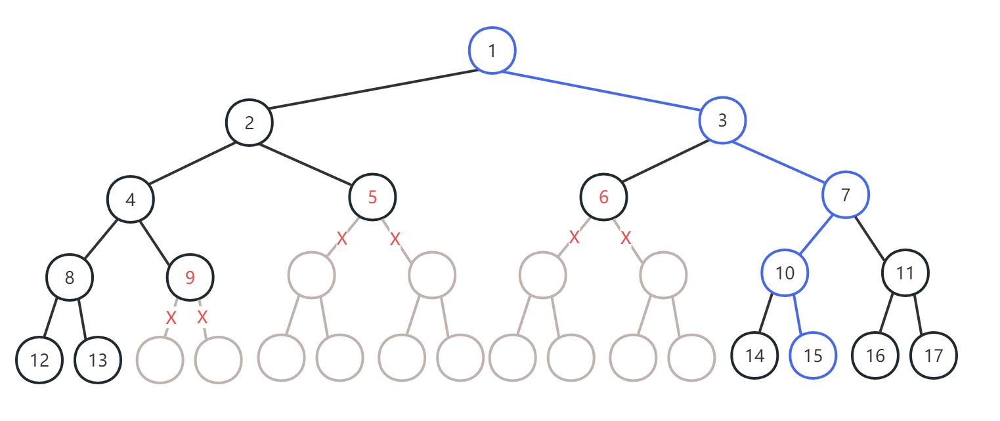

## 问题描述

输入给定一系列缺损点，将一棵无限深度的满二叉树进行重新编号，编号方式为从1开始逐行从左至右顺序编号，缺损点得到编号后，其子树被删去，后续编号中该子树的结点跳过不编号，编号后的树被称为“缺损二叉树”。例如下图为缺损点为{5，6，9}的缺损二叉树的一部分（下方可无限延长），红色数字标注了缺损点，其下方灰色子树被删去。对于输入给定的目标编号，输出缺损二叉树上根节点到目标结点的路径，该路径用经过的所有结点的编号表示。下图中，蓝色表示根结点到目标结点15的路径，路径用途径结点编号{1,3,7,10,15}表示。

 
## 输入格式

第一行为两个整数N和M，N表示缺损点数目，M表示目标点的数目。
第二行为N个缺损点的编号，按从小到大顺序排列。
第三行为M个目标点的编号，按从小到大顺序排列。
下方给出的输入样例表示缺损点为{5,6,9}，目标点为{3,9,15,22}。

## 输出格式
每一行输出根节点到一个目标点的最短路径，路径用途径节点编号表示。
如果该路径不存在，则输出0。
共输出M行。