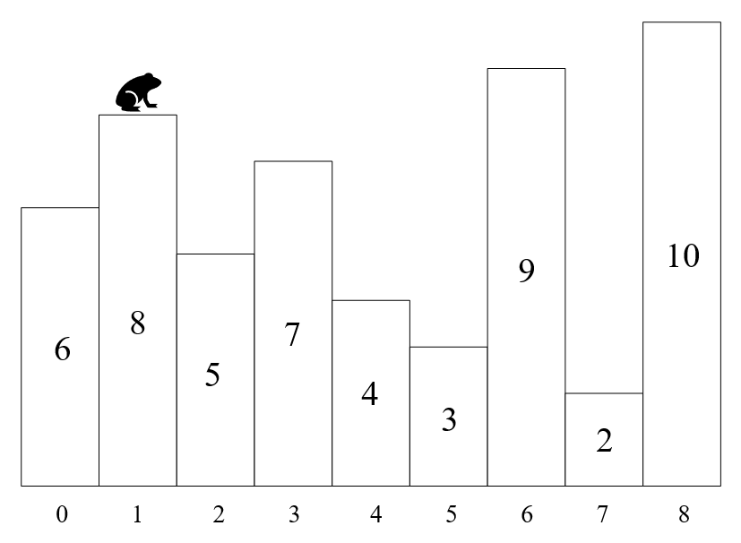

## 问题描述

有一系列相邻的台阶，每级台阶具有不同的高度，台阶间的水平距离相等，如图所示

有一只青蛙在不同台阶之间跳跃，设青蛙可以跳跃的最长水平距离为K个台阶，最大的垂直距离为H（需要注意的是，为简化问题，垂直距离只需考虑跳跃起点和终点的高度差，不需要考虑途中经过的台阶高度和起点的高度差），以上图为例，若K=5，H=2，则青蛙可以从当前位置跳跃到编号为{0, 3, 6}的三个台阶，因为这三个台阶与当前台阶的水平距离均不大于5，且垂直距离的绝对值分别为{2, 1, 1}，均不大于2。
现在总共有M个连续台阶，并给定每个台阶的高度，试求青蛙一共可能在多少对台阶间跳跃？

## 输入格式

输入为两行
第一行为三个整数，分别为台阶数量M，青蛙可以跳跃的最长水平距离K，可以跳跃的最大垂直距离H
第二行为M个整数，依次为各个台阶的高度

## 输出格式
输出为一个整数，为青蛙可以跳跃的台阶对数