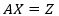
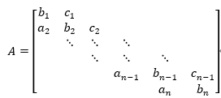
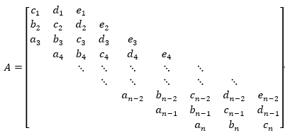
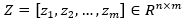
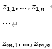

## 测试
考虑如下的带限矩阵方程组：

其中为带限的三对角或五对角矩阵，若为三对角矩阵则有以下形式：

若为五对角矩阵则有以下形式：

由m个列向量构成。
现在给定非奇异矩阵A和矩阵Z，求解矩阵X。
 
## 输入格式
第1行输入p，表示矩阵A中存在非零元素的对角线的条数，p为3或5。
第2行输入n和m，表示矩阵A的维数和矩阵Z的维数。其中n不超过10000，m不超过500.
第3行到第p+2行，按照从矩阵A的最上方的对角线到最下方的对角线的顺序依次输入各对角线的元素值。
即对于三对角矩阵，第3行输入$c_1, c_2, \dots, c_{n-1}$，第4行输入$b_1, b_2, \dots, b_n$，第5行输入$a_2, \dots, a_n$；
对于五对角矩阵， 第3行输入$e_1, e_2, \dots, e_{n-2}$，第4行输入$d_1, d_2, \dots, d_{n-1}$，第5行输入$c_1, c_2, \dots, c_n$，第6行输入$b_2, \dots, b_n$，第7行输入$a_3, \dots, a_n$。
最后m行每行输入n个浮点数，为别为矩阵Z的第m列向量zm的n个元素值，即

## 输出格式
输出共m行，每行为n个浮点数，分别为矩阵X的每一列的各个元素值，每个元素值结果四舍五入保留4位小数。